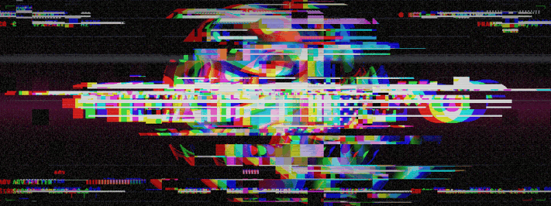

<p align="center">
  
</p>

<p align="center">
  <sub><code>COMPUTER GRAPHICS</code> &nbsp;⁄&nbsp; <code>RENDERING</code> &nbsp;⁄&nbsp; <code>VISUAL EFFECTS</code></sub>
</p>

<br>

> Pictures made from math, and what happens when the math breaks.

I work on computer graphics: rendering, shaders, simulation and real-time VFX.

<br>

### ▍ SIGNAL

The banner is a real-time WebGL2 piece, a render pipeline eating itself.

**Pass A** raymarches a signed-distance gyroid lattice: chrome with thin-film iridescence, lit by a procedural studio of strip softboxes and coloured kickers, with ACES tone mapping. During each burst, macroblocks leak the renderer's own debug buffers (**normals**, **depth**, **march-iteration heat**) into the final image.

**Pass B** corrupts the signal. It tears scanline slices, displaces and posterizes macroblocks like a datamoshed codec, smears bright pixels sideways (pixel sorting), splits the colour channels, and flashes the frame inverted at the peak. The timing is written by hand: quiet passages, one big hit, and a build back into a seamless loop.

```
studio/index.html    live piece: open it in a browser and move the mouse to disturb it
studio/capture.mjs   deterministic frame capture (headless Chromium) → ffmpeg → assets/banner.gif
```

<br>

<p align="center"><sub>SKINKEBRAVIA / STUDIO</sub></p>
